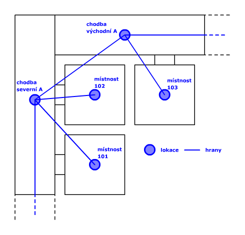
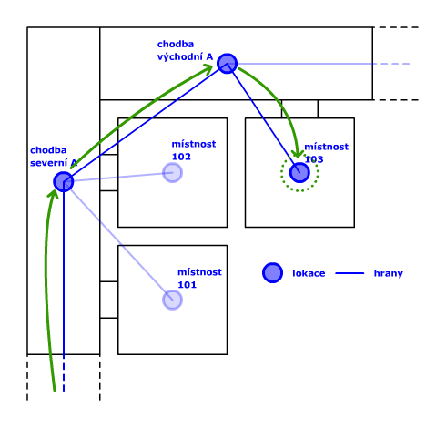
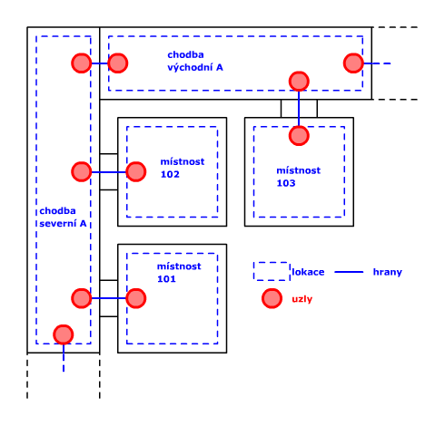
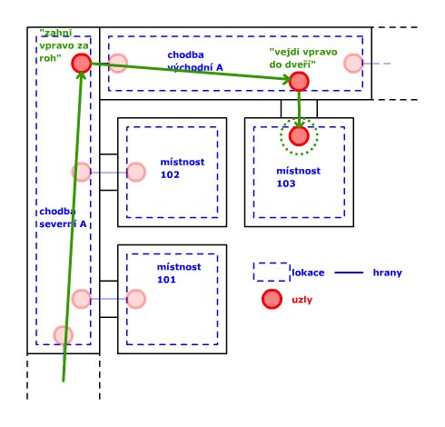
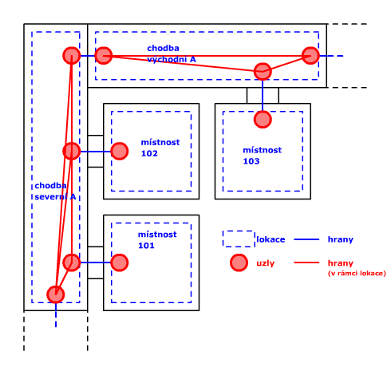
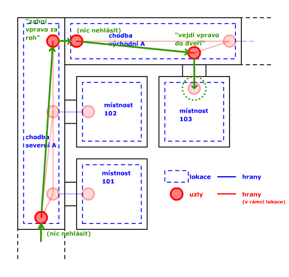

# Povídání o mapách #

Mapy jsou standardnì reprezentovány (orientovanımi) grafy. Vrcholy pøedstavují místnosti, pøípadnì vıtahy, eskalátory, schodištì nebo úseky chodeb—souhrnnì jim budeme øíkat **lokace**. Hrany jsou pøechody mezi jednotlivımi lokacemi, a� u� jde o dveøe nebo o abstraktnìjší pøechody jako zatáèky v chodbách. Ka�dá hrana je pak ohodnocená délkou (pro nás èasem, kterı zabere hranu pøekonat). Na takovı graf mù�eme pro nalezení nejkratší cesty pou�ít celou škálu algoritmù (tak�e nejspíš skonèíme u A* nebo u Dijkstrova algoritmu).

Takovı graf nám udává jen *topologii* mapy—øíká jen, odkud je mo�né kam projít. U� ale neporadí, kudy se má pøípadnı u�ivatel ubírat (v pojmech jako "jdi rovnì" nebo "zahni vlevo"), tj. neøíká nic o *geometrii* mapy. Pokud to chceme napravit, mù�eme pøidat ke ka�dé lokaci (tedy napø. úseku chodby) nìkolik **uzlù**, tj. bodù na mapì, které by mìl u�ivatel projít, pokud se tøeba chce dostat z chodby do místnosti. V ka�dé lokaci je tedy po jednom uzlu pro ka�dou hranu, která z ní vychází. Pokyny pro u�ivatele jsou pak formulované pomocí uzlù, proto�e pøechod z uzlu v jedné lokaci do uzlu v druhé lokaci je vlastnì toté�, co pøechod po hranì.

Tato úprava odhaluje jistı zádrhel toho, kdy� vyhledávání cesty probíhá na grafu tvoøeném jen lokacemi. Proto�e mezi dvìma lokacemi je v�dy jen jedna hrana, taková cesta má v�dy stejnou délku. Jen�e pokud je lokací napø. úsek chodby, tak se délka cesty liší podle toho, z které strany jsme do chodby vstoupili a kde z ní potøebujeme uhnout. Mù�e se tedy napøíklad stát, �e kdy� chodby tvoøí okruh, tak A* vyhodnotí jako vıhodnìjší jít jedním smìrem, kdy� ve skuteènosti je vıhodnìjší pøijít z druhé strany. Øešení je nasnadì: roli vrcholù ve vyhledávacím grafu musí místo lokací hrát uzly, a všechny uzly v rámci stejné lokace musejí bıt navzájem propojeny patøiènì ohodnocenımi hranami. Na takovı graf u� A* pou�ít mù�eme.

### Shrnutí ###
* **lokace** zahrnuje jeden nebo více uzlù a reprezentuje smysluplnı celek na mapì, tj. místnost, vıtah, chodbu apod.
* **uzel** pøedstavuje konkrétní místo, kde èlovìk opouští lokaci (a vstupuje do jiné)
* **hrana** spojuje dva uzly, a pøedstavuje buï pøechod z jedné lokace do druhé (pokud je ka�dı uzel z jiné lokace) nebo pøesun v rámci jedné lokace (cesta od jednìch dveøí k druhım)
